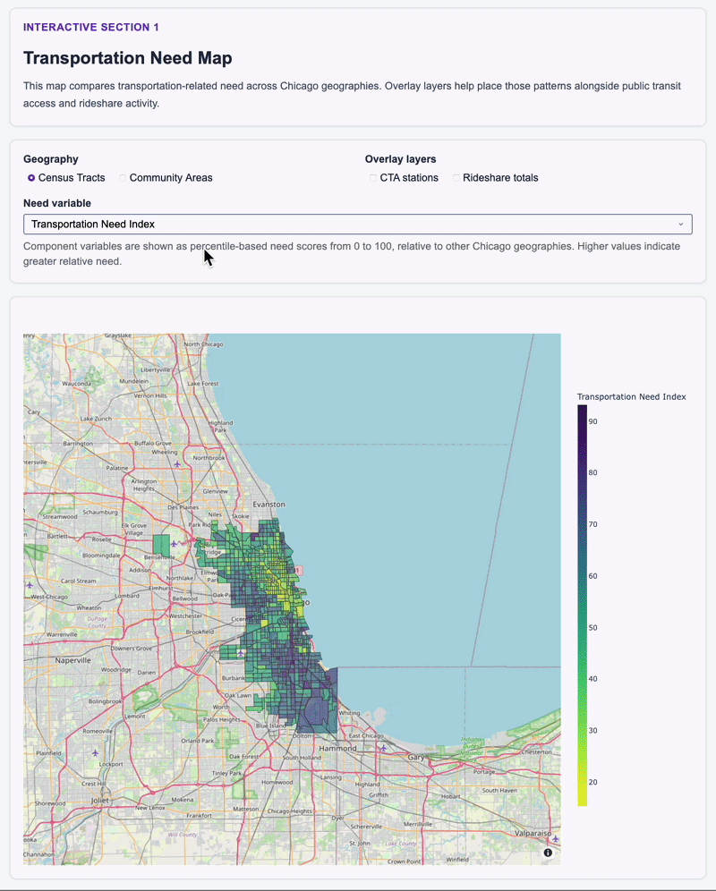
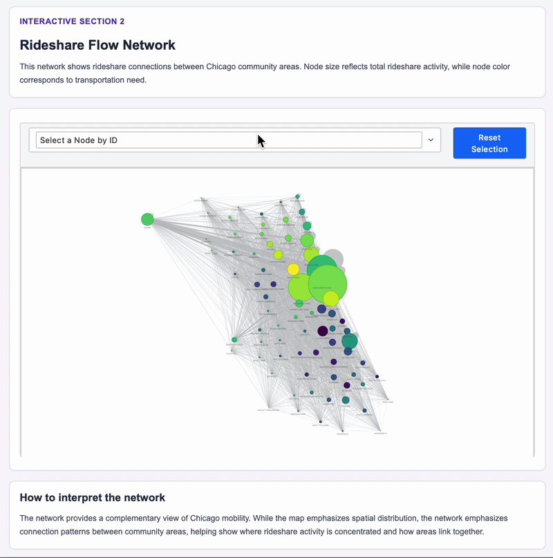

# Project CDHW

## Abstract

This project examines mobility patterns in Chicago for 2024, exploring how public transit usage, rideshare activity, and neighborhood-level characteristics vary across the city. The analysis integrates CTA rail ridership, rideshare trip data, American Community Survey demographics, and walkability measures, all aligned to Chicago community areas. The project produces a geospatial dashboard built in Dash for exploring neighborhood-level mobility patterns and a network visualization built with PyVis showing movement between community areas.

The analysis integrates:

- CTA ridership rail data
- Rideshare trip data
- American Community Survey ACS data


All data are aligned to census tracts and community areas for spatial comparison. The project produces:

- A geospatial dashboard built in Dash to explore neighborhood-level mobility patterns
- A network visualization built with PyVis showing movement between community areas

The goal is to document, describe and explore how movement varies across Chicago in 2024 and how it aligns with neighborhood-level characteristics.

#### Project Demo

https://youtu.be/EO2vdreIc48

---

## Team Members

- Ciara Staveley-O'Carroll
- David Houghton
- Hannah Barton
- Wendy Wang

---

## Screenshots


### Choropleth Visualization




<br>

### Network Visualization



---

## Citation

### CTA Ridership Data

https://www.transitchicago.com/ridership/

https://data.cityofchicago.org/Transportation/CTA-Ridership-L-Station-Entries-Daily-Totals/

https://data.cityofchicago.org/dataset/CTA-L-Rail-Stations-Shapefile/vmyy-m9qj/about_data

### Chicago Rideshare Data

https://data.cityofchicago.org/Transportation/Transportation-Network-Providers-Trips-2023-2024-/n26f-ihde/about_data

### American Community Survey ACS

https://www.census.gov/data/developers/data-sets/acs-5year.html

### Census Tract Boundaries 2024

[U.S. Census Bureau TIGER Line Files tl_2024_17_tract](https://meta.geo.census.gov/data/existing/decennial/GEO/GPMB/TIGERline/Archived_19115/tl_2024_17_tract.shp.iso.xml)

### pytidycensus Documentation

https://pygis.io/docs/d_pytidycensus_intro.html

### Dash Documentation

https://dash.plotly.com/tutorial

### PyVis Documentation

https://pyvis.readthedocs.io/

---

## How to Run

1. [Install UV](https://docs.astral.sh/uv/getting-started/installation/)

2. Clone the repo for the project using the url on GitHub.

```
git clone git@github.com:uchicago-2026-capp30122/project-cdhw.git
```

3. Synchronize the virtual environment & install the necessary dependencies to run the project.

```
uv sync
```

4. In the root directory, run the following command in the terminal. Initialize the dashboard by running the following command in the terminal, of the root directory. 

```
uv run python -m app
```

5. The terminal will show: "Dash is running on http://...". Copy-paste this url from the terminal and into your web browser. This will take you to the interactive dashboard.


6. To exit the program, run "Ctrl + C" in the terminal.
