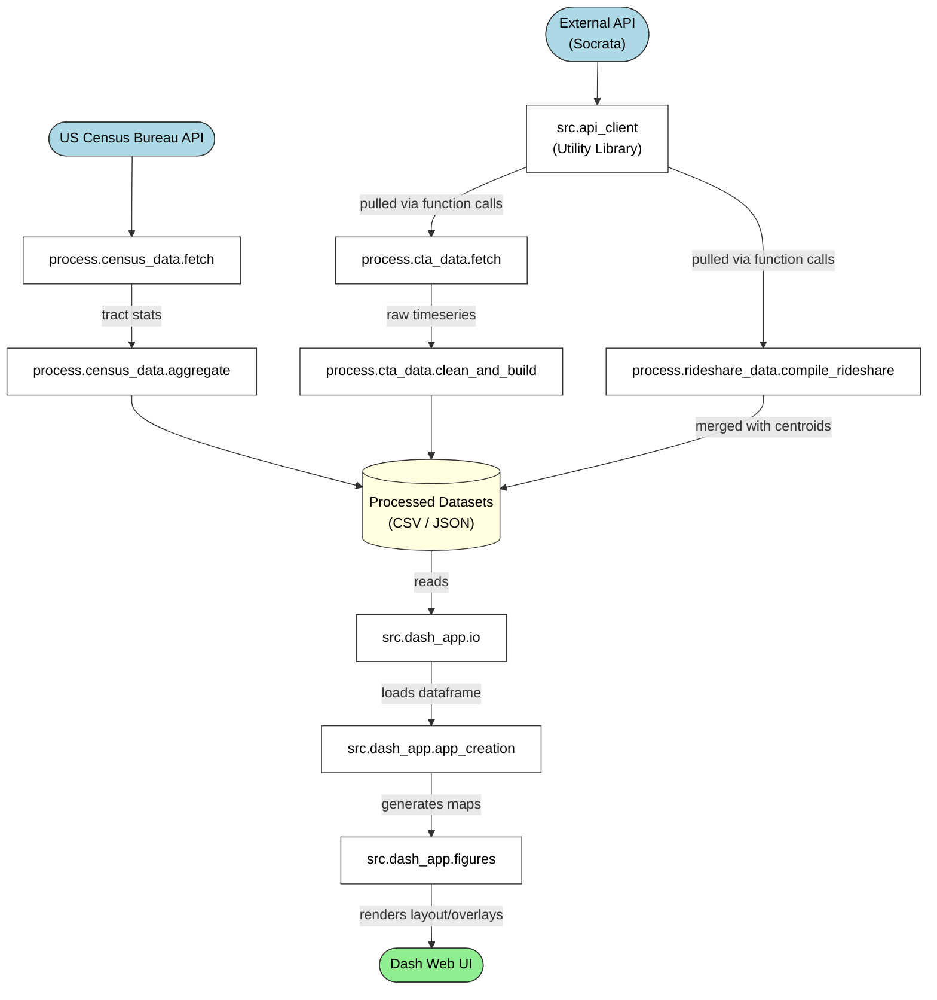
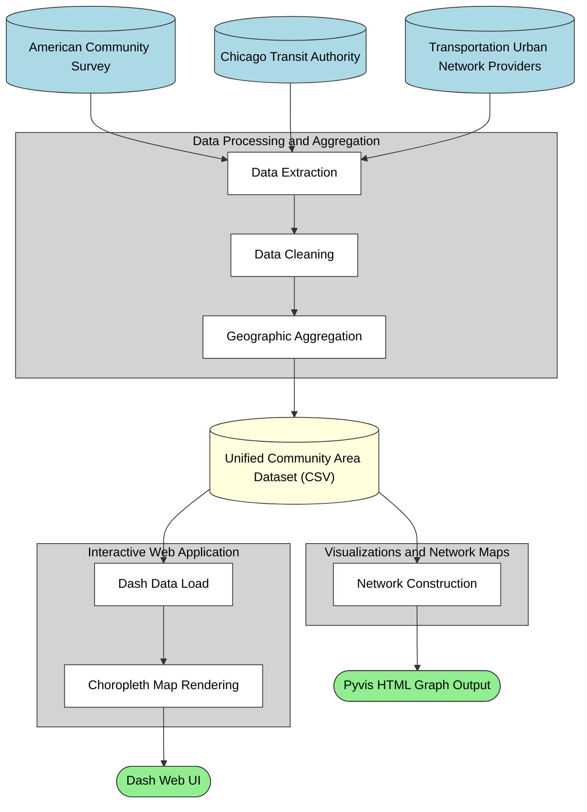

# Data Documentation

The foundation of this Chicago mobility project relies on integrating diverse, geospatial datasets to understand transportation patterns and demographic needs across the city. By combining local transit details, rideshare volumes, and socioeconomic census indicators, we process and synthesize large-scale urban data into standardized Community Area metrics for effective analysis and interactive visualization.

## Data Sources

### 1. Chicago Rideshare Data (Transportation Network Providers Trips)
* **Description:** Rideshare trip data used to measure movement between areas.
* **Source:** Chicago Data Portal (Socrata View ID: `6dvr-xwnh`).
* **Access Method:** Accessed dynamically via the **Socrata SODA 3.0 API**. The project uses python's `requests` library to send POST requests containing SoQL (Socrata Query Language) to group trips by pickup and drop-off community areas (get_edges_grouped_by_ca in src/api_client.py). This requires a Socrata App Token (`SOCRATA_APP_TOKEN`).

### 2. Chicago Community Area Boundaries
* **Description:** GeoJSON geometries of Chicago's community areas used to align spatial data.
* **Source:** Chicago Data Portal (Socrata View ID: `igwz-8jzy`).
* **Access Method:** Accessed dynamically via the **SODA 3.0 API**. A SoQL query retrieves the raw boundary geometry and community names, which are then parsed into centroid points using the `shapely` library (get_community_areas in src/api_client.py).

### 3. American Community Survey (ACS) Data
* **Description:** Demographic data at the census tract level for Illinois (specifically Cook and DuPage counties). The dataset pulls the 5-year estimates for 2024. The variables collected include total population, median household income, household vehicle ownership, disability status, and sex by age (to sum demographic segments 65 and older).
* **Source:** U.S. Census Bureau API.
* **Access Method:** The data is accessed directly from the U.S. Census Bureau's API endpoint (`https://api.census.gov/data/{year}/acs/acs5`) using the `httpx` and `pandas` Python libraries. The script fetch_census_data.py makes GET requests to fetch demographic variables for all tracts within the specified counties and outputs the consolidated raw data to a local CSV file (`data/raw/acs5_2024_il_tract_raw.csv`).

### 4. CTA "L" Ridership & Station Data
* **Description:** Daily totals of entries at "L" stations, station locations, and station boundaries. 
* **Source:** Chicago Data Portal.
  * Ridership totals (View ID: `t2rn-p8d7`)
  * Station locations (View ID: `3tzw-cg4m`)
  * Station Shapefiles (View ID: `vmyy-m9qj`)
* **Access Method:** 
  * This data is configured to be requested directly as CSVs into Pandas DataFrames using `pd.read_csv` against Socrata `.csv` resource endpoints (fetch_csv in src/api_client.py). 
  * The geographic station shapefile is downloaded as a compressed ZIP file using standard HTTP GET requests (download_file in src/api_client.py).

### 5. Census Tract Boundaries 2024
* **Description:** Census boundary shape files used for spatial alignments. 
* **Source:** U.S. Census Bureau (TIGER Line Files `tl_2024_17_tract`).
* **Access Method:** These are downloaded directly via GIS URL endpoints as a zip file (`data/tl_2024_17_tract.zip`).

## Data Gaps

The project’s geographic analysis relies entirely on CTA rail (“L”) entries and rideshare trips, leaving a key gap in spatial bus ridership. Because CTA bus data is assessed only at the systemwide level rather than by station or neighborhood, areas that rely heavily on buses (particularly many communities on Chicago’s South and West sides) may appear to have lower mobility than they actually do. This lack of geographic detail could distort the spatial analysis, potentially labeling these transit-dependent neighborhoods as isolated simply because their primary transportation mode is not represented in the neighborhood-level data.

The analysis is also limited in its ability to connect observed mobility with the demographics of the people traveling. The transportation datasets record aggregate trip counts at specific locations but do not capture riders’ home origins or socioeconomic characteristics. As a result, it is difficult to confidently assess the social isolation of vulnerable populations using neighborhood traffic alone. For instance, high trip activity in a lower-income tract could reflect the movement of visitors, shoppers, or commuters rather than the mobility of residents.

Finally, by defining mobility solely through public transit and rideshare use, the study excludes other common transportation modes, particularly private vehicles, cycling, and walking. Although ACS demographic data includes information on household vehicle access, the absence of trip data for private cars means the project’s network visualizations may underrepresent movement in car-dependent neighborhoods. This gap could lead the analysis to interpret low CTA or rideshare usage as low overall mobility, potentially portraying car-oriented communities as disconnected when they are not.

## Data Challenges

One challenge in this project was the inconsistent geographic units across the different data sources. Rideshare trips report pickup and drop-off locations (often rounded or suppressed for privacy), American Community Survey (ACS) demographic data is typically reported at the Census Tract level, and CTA station data consists of exact geographic points, while CTA systemwide ridership provides no spatial detail. These differences make it difficult to directly compare or join the datasets. To address this, the team used Chicago Community Areas as a common geographic framework. Rideshare data is queried and grouped by pickup and drop-off community areas through the Socrata API, while ACS tract-level data and CTA station coordinates are mapped into these boundary polygons. This approach standardizes the spatial unit across the analysis.

A second challenge was the large size and computational demands of the transportation datasets. The Chicago Rideshare dataset contains tens of millions of records, and the CTA station-level dataset includes more than 1.3 million entries. Downloading and processing these datasets locally would quickly exceed memory limits and slow analysis and visualization. To manage this, the project relies on server-side aggregation and API queries. Instead of downloading individual rideshare trips, the team uses Socrata Query Language (SoQL) to have the City of Chicago’s servers pre-aggregate the data. The system returns condensed matrices of total trips between origin and destination Community Areas for selected date ranges.

A third challenge involves missing or suppressed records in the Chicago Rideshare dataset. To protect rider privacy, the City of Chicago removes geographic identifiers when trip volumes in a specific area are very low. This can obscure mobility patterns in already sparse or isolated neighborhoods. To reduce this issue, the analysis aggregates rideshare data at the Community Area level rather than the smaller Census Tract level. Because Community Areas contain larger populations and higher trip volumes, the counts are less likely to fall below the city’s privacy threshold. Remaining null values are removed using SQL filters.

Finally, the datasets use different naming conventions and identifiers because they originate from separate organizations, including the US Census Bureau, the CTA, and the City of Chicago. The ACS demographic dataset often uses string names (for example, “Rogers Park”) for community areas, while the City of Chicago boundary dataset uses a numeric ID (`area_numbe`), and Census shapefiles use an 11-digit `GEOID`. The team addressed this by building data pipelines that crosswalk these formats. Python dictionaries map numeric IDs to standardized text labels, and string processing aligns naming conventions so the final Pandas data frames can be joined across sources.

## Data Flow

### 1. Data Ingestion
The data flow begins with two main external sources providing raw information. The application interfaces with them through specialized fetching pipelines:
- **US Census Bureau API:** Handled by `process.census_data.fetch`, which accesses the census data directly.
- **External API (Socrata):** Provides city data. The `src.api_client` acts as a utility library to retrieve data from Socrata, which is then pulled via function calls into two pipelines:
  - **CTA Data:** Pulled by `process.cta_data.fetch`
  - **Rideshare Data:** Pulled by `process.rideshare_data.compile_rideshare`

### 2. Processing & Storage
Once the data is fetched, it undergoes specific transformations depending on its domain before it is stored:
- **Census Data:** The census fetcher extracts **tract stats** and passes them to an aggregation phase (`process.census_data.aggregate`).
- **CTA Data:** The CTA fetcher provides **raw timeseries** data, which is then routed to a cleaning and building phase (`process.cta_data.clean_and_build`).
- **Rideshare Data:** The rideshare fetcher retrieves **raw counts** and merges them geographically with community area centroids.

Following these respective processing transformations, all three data streams converge and are saved to disk as **Processed Datasets (CSV / JSON)**.

### 3. Visualization User Interface
The final phase involves taking the processed datasets and turning them into an interactive web dashboard for the end user:
- **Data Reading:** The `src.dash_app.io` component **reads** the CSV and JSON files from the Processed Datasets.
- **Data Loading:** It then **loads the dataframe** and passes it along to the app creation module (`src.dash_app.app_creation`).
- **Map Generation:** The app creation module **generates maps** and forwards them to the figures module (`src.dash_app.figures`).
- **UI Rendering:** Finally, the figures module **renders the layout/overlays**, which are successfully displayed to the user on the **Dash Web UI**. 

  

  

# Project Structure Report

The Chicago mobility project architecture is designed to transform complex, disparate urban transportation data into accessible, interactive visualizations. The workflow is organized into dedicated modules that handle the sequential flow of information. It begins with data acquisition and geographic aggregation from external sources. The resulting standardized dataset is then utilized by a web application for dynamic geospatial mapping, and by a separate visualization module to produce detailed network graphs.

## Data Processing and Aggregation

The data processing module serves as the functional core for the project. It is subdivided into specialized pipelines managing information from the American Community Survey, the Chicago Transit Authority, and the city's Transportation Urban Network Providers portal. 

The processing workflow progresses through three distinct phases:

*   **Data Extraction:** Scripts utilize the `httpx` and `urllib` libraries to execute HTTP GET requests against the external endpoints. Depending on the API, the responses are either parsed from JSON text into native Python dictionaries or read directly as streaming CSV text into `pandas` DataFrames.

*   **Data Cleaning:** Subsequent scripts standardize the retrieved data using `pandas`. This involves imputing missing `NaN` values, managing outliers, and computing derived indicators. For instance, the census cleaning phase algorithmically calculates a composite transportation need index from various underlying neighborhood socioeconomic metrics by computing weighted averages and percentiles across rows.

*   **Geographic Aggregation:** The raw datasets are originally structured around disparate spatial scales, requiring an alignment phase. The processing module utilizes `geopandas` to conduct spatial joins and geometric overlays, aggregating granular census tracts and specific transit Point geometries up to the uniform standard of Chicago's 77 official Community Area polygons. Finally, a single integration script joins these parallel pipelines to output a unified feature dataset as a CSV file for further analytical use.

## Interactive Web Application

The project's primary interface is an interactive web dashboard built using the `dash` framework to visualize the standardized community area data. This module is responsible for the user facing representation of the city's integrated mobility metrics.

The application utilizes interconnected submodules, including application configuration, data retrieval using `pandas`, coordinate plotting via `plotly`, and dynamic layout rendering using `dash` HTML components. The dashboard initializes a local WSGI server environment and parses the processed community area feature dataset. It constructs an interactive choropleth map that ties the socioeconomic indicators, like the calculated transportation need index, directly to the community area GeoJSON shapes, allowing users to query the underlying data structures.

## Visualizations and Network Maps

Operating parallel to the web dashboard, the visualization module is dedicated to generating static, detailed network maps based on the processed dataset. These tools focus specifically on spatial connectivity and movement corridors across the city.

The scripts within this module leverage the `networkx` library to convert the flow of rideshare trips and public transit ridership into interrelated node networks, representing communities as nodes and trips as weighted edges. The nodes and edges are then passed to the `pyvis` library, which renders the complex interactions and outputs standalone HTML files containing interactive JavaScript graphs. This component provides an alternative, non tabular perspective on mobility patterns that supplements the findings presented in the core dashboard.

## Testing

The testing module utilizes the `pytest` framework, ensuring the reliability of the data transformations. The automated tests validate the mathematical and structural logic inherent within the processing pipelines, verify that tracts correctly aggregate to community areas using test DataFrame fixtures, and confirm the integrity of the transportation need index numeric formulas.

  

  

# Team Responsibilities

# Final Thoughts

The project began with the goal of better understanding how patterns of movement across Chicago might vary between neighborhoods and how those patterns relate to the characteristics of the people who live there. In the end, the project succeeded in building a clear framework for exploring those questions. By bringing together transportation data and demographic information and organizing them around Chicago’s community areas, the project created a way to look at mobility across the city in a consistent and interpretable way. The visual tools developed for the project (maps and network diagrams) help make these patterns easier to see, allowing users to notice how movement is concentrated in some places while appearing more limited in others. In this way, the project fulfilled its core intention of making mobility patterns visible and easier to think about in relation to neighborhood context.

At the same time, the project reinforced an important lesson about what mobility data can and cannot tell us. Transportation datasets show where trips occur, but they do not fully reveal who is traveling or why. Because of this, the project ultimately focuses on helping people observe patterns rather than drawing firm conclusions about the experiences of specific populations. Even so, the work provides a useful starting point for thinking about how mobility and neighborhood characteristics interact across the city. By assembling these datasets, building the tools to explore them, and presenting the results in an accessible form, the project opens the door for deeper conversations about mobility, access, and how different communities move through urban space.
